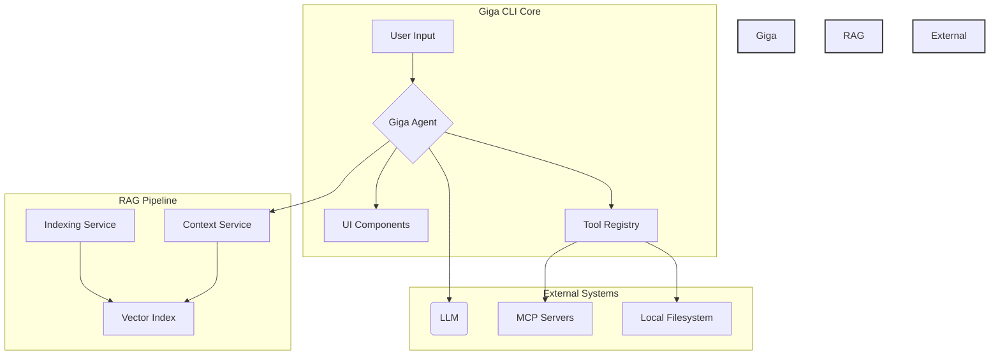

# Giga CLI - Architectural Overview

This document provides a comprehensive overview of the Giga CLI's architecture, with a focus on its two core components: the Model Context Protocol (MCP) server integration and the Retrieval-Augmented Generation (RAG) pipeline.

## High-Level Architecture

The Giga CLI is a sophisticated command-line interface that leverages a modular architecture to provide a flexible and extensible development environment. At its core, it is designed to interact with large language models (LLMs) and enhance their capabilities with real-time context from the user's codebase.

The system is built around two key pillars:

1.  **MCP Server Integration:** This allows the CLI to connect to and consume tools from external servers, effectively extending its functionality with custom, domain-specific capabilities.
2.  **RAG Pipeline:** This system automatically enriches user prompts with relevant code context, enabling the LLM to provide more accurate and context-aware responses.

These two components work in tandem to create a powerful and intelligent CLI that can understand and interact with a user's codebase in a meaningful way.



## MCP Server Architecture

The MCP server integration is designed to be a flexible and robust system for extending the CLI's capabilities. It supports two types of servers, each with its own communication protocol, and is managed by a central controller.

### Core Components

*   **`McpManager`:** This is the heart of the MCP system. It is a singleton that manages the lifecycle of all connected servers, providing a unified interface for discovering and executing tools.
*   **`McpClient`:** This class handles communication with stdio-based servers. It spawns the server as a child process and uses a JSON-RPC protocol over standard input/output to interact with it.
*   **`HttpMcpClient`:** This class is responsible for communicating with HTTP-based servers. It also uses a JSON-RPC protocol but sends requests over HTTP/S.
*   **`HttpMcpManager`:** This is a specialized manager for HTTP servers. It handles the spawning, monitoring, and even automatic restarting of server processes, ensuring they are always available.
*   **`McpTool`:** This class exposes the MCP functionality to the user, allowing them to list connected servers, view available tools, and execute them directly from the command line.

### Architectural Diagram

```mermaid
graph TD
    subgraph Giga CLI
        A[User Command] --> B{McpTool};
        B --> C[McpManager];
    end

    subgraph Stdio Server
        D[McpClient] --> E(JSON-RPC);
        E --> F[Child Process];
    end

    subgraph HTTP Server
        G[HttpMcpClient] --> H(JSON-RPC over HTTP);
        H --> I[External Server];
        J[HttpMcpManager] --> I;
    end

    C --> D;
    C --> G;
    C --> J;

    style Giga CLI fill:#f9f,stroke:#333,stroke-width:2px
    style "Stdio Server" fill:#ccf,stroke:#333,stroke-width:2px
    style "HTTP Server" fill:#cfc,stroke:#333,stroke-width:2px
```

## RAG Pipeline Architecture

The RAG pipeline is a sophisticated, multi-stage process that enriches user prompts with relevant code context. It is designed to be highly configurable and efficient, with a background service that keeps the index up-to-date in real-time.

### Core Components

*   **`RAGConfigManager`:** This class manages the RAG system's configuration, which is stored in a `.giga/rag-config.json` file. This allows for fine-grained control over the entire pipeline.
*   **`ChunkingService`:** This service is responsible for breaking down source code into smaller, indexable chunks. It supports both logical and fixed-size chunking strategies.
*   **`RAGService`:** This is the core of the RAG pipeline. It generates vector embeddings for each code chunk and stores them in a local vector index.
*   **`IndexingService`:** This service runs in the background, watching for file changes and automatically re-indexing them to ensure the RAG pipeline always has access to the latest code.
*   **`RAGContextService`:** This is the main entry point for the RAG pipeline. It enhances user prompts, performs semantic searches against the vector index, and injects the relevant context into the prompt before it is sent to the LLM.

### Architectural Diagram

```mermaid
graph TD
    subgraph Configuration
        A[rag-config.json] --> B{RAGConfigManager};
    end

    subgraph Indexing
        C[Filesystem] --> D{ChunkingService};
        D --> E[Code Chunks];
        E --> F{RAGService};
        F --> G[Vector Index];
    end

    subgraph Real-time Updates
        H[File Watcher] --> I{IndexingService};
        I --> F;
    end

    subgraph Prompt Enrichment
        J[User Prompt] --> K{RAGContextService};
        K --> G;
        K --> L[Enriched Prompt];
        L --> M(LLM);
    end

    B --> D;
    B --> F;
    B --> I;
    B --> K;

    style Configuration fill:#f9f,stroke:#333,stroke-width:2px
    style Indexing fill:#ccf,stroke:#333,stroke-width:2px
    style "Real-time Updates" fill:#cfc,stroke:#333,stroke-width:2px
    style "Prompt Enrichment" fill:#ffc,stroke:#333,stroke-width:2px